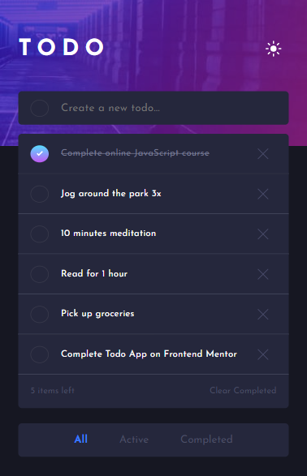

## todo-app-with-change-theme

* This Todo-App can:
>

* Creates to-dos and removes to-dos.
>

* Change between a light or dark theme.
>

* Show just the to-do activate, or completed's, or both. 
>

* Clear all completed to-dos.

> This is a challenge of [FrontEnd Mentor](https://www.frontendmentor.io/challenges/todo-app-Su1_KokOW/hub/todo-app-SZHy8rqeq).

### Result

> #### See the result live [here](https://todo-app-with-change-theme-lusk1nha.vercel.app/)

> ###### Desktop Version - Dark Theme

> ###### Desktop Version - Light Theme

> ###### Mobile Version - Dark Theme

>###### Mobile Version - Light Theme

